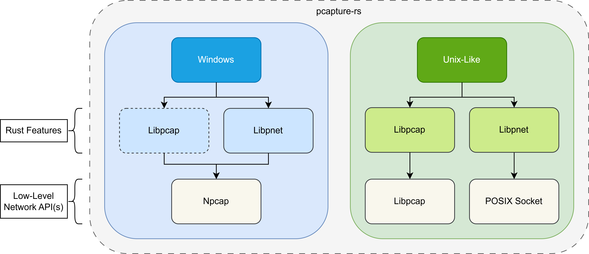

# pcapture-rs

A new generation of traffic capture library based on `libpnet`, `libpcap` and `npcap`.

This library requires root permissions on Linux.



## With so many features, which one should I choose?

### Windows

To put it simply, as you can see on the left side of the figure, `pcapture` on Windows is essentially based on the `npcap` library, regardless of which feature you choose, whether it's `libpcap` or `libpnet`.

Also, if you observe carefully, you'll notice that `libpcap` is highlighted with a dashed box on Windows, because on Windows, using feature `libpcap` actually directly calls `npcap`. **Therefore, on Windows, you can directly use the feature `libpnet`, using `libpcap` will result in an error.**

### Unix-Like

The Unix-like operating systems mentioned here include Linux, *BSD, and macOS, among others.

Because there are many excellent Rust crates on Linux, I selected these two after testing to support packet capture for `pcapture`.

The first one is `libpcap`, which is an excellent packet capture library written in C and well optimized for the Linux kernel, while also offering very good performance.

The other is `libpnet`, which is a POSIX socket-based library (this library is not actually specifically for packet capture). The reason for choosing this library is that it can run on most Unix-like systems without requiring additional software installation.

### Comparison

Well, the advantage of the `libpnet` version is that it does not require any additional software installation (except for Windows). In scenarios where high performance is not required and for temporary use, the `libpnet` version of the program can be chosen.

The `libpcap` version is the opposite of the `libpnet` version. It requires the additional installation of the `libpcap-dev` library (on Debian). When high performance is required (such as packet capture in high-traffic environments), the `libpcap` version can be chosen.

However, its working method is also different from the above versions. The `libpcap` version retrieves all data packets from the system cache at once and returns them to the user, while the `libpnet` version iterates one by one. In high-performance environments, the `libpnet` version can cause problems such as incorrect order of packets.

## Compared to pcap

### [pcap](https://crates.io/crates/pcap)

Why not use pcap to capture packets?

The `pcap` library does not support filters, which is easy to understand. In order to implement packet filtering, we have to implement these functions ourselves (it will be very uncomfortable to use).

(2025-9-24)

I recently discovered that `pcap` can experience packet loss in high-traffic environments ([github issues](https://github.com/rust-pcap/pcap/issues/388)). If you are interested in this, you can find detailed test code and procedures in this repository [link](https://github.com/rikonaka/pcap-issues).

## Platform

| Platform           | Note              |
| :----------------- | :---------------- |
| Linux              | supported         |
| Unix (*BSD, MacOS) | supported         |
| Windows            | supported (npcap) |

## Usage

```toml
pcapture = { version = "^0", features = ["pcapng", "libpcap"] }
```

If you want to replace it with the `libpnet` version.

```toml
pcapture = { version = "^0", features = ["pcapng", "libpnet"] }
```


## Libpcap Version Examples

```rust
use pcapture::Capture;
use pcapture::PcapByteOrder;
use pcapture::fs::pcapng::PcapNg;

pub fn test1() {
    let path = "test.pcapng";
    let pbo = PcapByteOrder::WiresharkDefault;
    // You must specify the interface, the 'all' option is not supported.
    let mut cap = Capture::new("ens33").unwrap();
    // BPF syntax filter
    cap.set_filter("tcp port 80");
    // This step will generate the pcapng headers.
    let mut pcapng = cap.gen_pcapng_header(pbo).unwrap();
    let h_len = pcapng.blocks.len();

    let mut i = 0;
    for _ in 0..5 {
        let blocks = cap.fetch_as_pcapng().unwrap();
        for b in blocks {
            pcapng.append(b);
            i += 1;
        }
    }
    // write all capture packets to test.pcapng
    pcapng.write_all(path).unwrap();

    let read_pcapng = PcapNg::read_all(path, pbo).unwrap();
    // By default, epb (EnhancedPacketBlock) is used to store packets instead of spb (SimplePacketBlock).
    // 1 shb (header) + x idb (interface infomation header) + i epb (traffic data)
    // | ------------------- h_len ---------------------- | + | ------ i ------- |
    assert_eq!(read_pcapng.blocks.len(), h_len + i);
}
```

## Libnet Version Examples

### Very simple way to capture the packets as pcapng format

```rust
use pcapture::Capture;
use pcapture::PcapByteOrder;
use pcapture::fs::pcapng::PcapNg; // for read pcapng file

fn main() {
    let path = "test.pcapng";
    let pbo = PcapByteOrder::WiresharkDefault;
    // You must specify the interface, the 'all' option is not supported.
    let mut cap = Capture::new("ens33").unwrap();
    // This step will generate the pcapng headers.
    let mut pcapng = cap.gen_pcapng_header(pbo).unwrap();
    let h_len = pcapng.blocks.len();

    for _ in 0..5 {
        let block = cap.next_as_pcapng().unwrap();
        pcapng.append(block);
    }
    // write all capture packets to test.pcapng
    pcapng.write_all(path).unwrap();

    let read_pcapng = PcapNg::read_all(path, pbo).unwrap();
    // By default, epb (EnhancedPacketBlock) is used to store packets instead of spb (SimplePacketBlock).
    // 1 shb (header) + x idb (interface infomation header) + 5 epb (traffic data)
    // | ------------------- h_len ---------------------- | + | ------ 5 ------- |
    assert_eq!(read_pcapng.blocks.len(), h_len + 5);
}
```

### And also the pcap format

Since pcap uses a 16-bit timestamp, it will be exhausted in 2038 (although it sounds far away), so it is recommended to use pcapng now.

```rust
use pcapture::PcapByteOrder;
use pcapture::Capture;
use pcapture::fs::pcap::Pcap; // for read pcap file

fn main() {
    let path = "test.pcap";
    let pbo = PcapByteOrder::WiresharkDefault;

    let mut cap = Capture::new("ens33").unwrap();
    let mut pcap = cap.gen_pcap_header(pbo).unwrap();

    for _ in 0..5 {
        let record = cap.next_as_pcap().unwrap();
        pcap.append(record);
    }
    // write all capture packets to test.pcap
    pcap.write_all(path).unwrap();

    let read_pcap = Pcap::read_all(path, pbo).unwrap();
    // The pcap file format and the pcapng file have completely different structures.
    // And pcap has only one file header,
    // but pcapng can have various headers with different functions.
    // 5 records, you can access the file header through 'read_pcap.header'.
    assert_eq!(read_pcap.records.len(), 5);
}
```

### And the most important filter features

I implemented a simple expression filter using the Shunting Yard algorithm.

```rust
use pcapture::PcapByteOrder;
use pcapture::Capture;

fn main() {
    let path = "test.pcapng";
    let pbo = PcapByteOrder::WiresharkDefault;
    // Building filters is very simple and easy to understand.
    // And support protocol filtering.
    let filter = "tcp and (ip=192.168.1.1 and port=80)";
    // Only support this bracket '(' in expression, but 'AND' and 'OR' support both uppercase and lowercase.
    // More examples:
    // let filter = "tcp and (ip=192.168.1.1 or port=80)";
    // let filter = "icmp and ip=192.168.1.1";
    // let filter = "!icmp and ip=192.168.1.1"; // ! means not include any icmp packet
    // let filter = "icmp and ip!=192.168.1.1"; // != means not include any packet which addr is 192.168.1.1
    // Other valid values:
    // [mac, srcmac, dstmac, ip, addr, srcip, srcaddr, dstip, dstaddr, port, srcport, dstport]
    // Note: the expression ip=192.168.1.1 is equal to addr=192.168.1.1

    // You can use the following code to print all supported protocols.
    // use pcapture::filter;
    // let valid_procotol = filter::valid_protocol();
    // println!("{:?}", valid_procotol);

    let mut cap = Capture::new("ens33").unwrap();
    cap.filter(filter).unwrap();
    let mut pcapng = cap.gen_pcapng_header(pbo).unwrap();

    for _ in 0..5 {
        let block = cap.next_as_pcapng().unwrap();
        pcapng.append(block);
    }
    // write all capture data to test.pcapng
    pcapng.write_all(path).unwrap();
}
```

### Sometimes you just wanna write the packet to the disk immediately

The above examples all store the captured packets in memory and then write them to disk at once use `write_all` function, but this is not acceptable in practice, because this will cause a lot of memory usage on the server.

```rust
use std::fs::File;
use pcapture::PcapByteOrder;
use pcapture::Capture;

fn main() {
    let path = "test.pcapng";
    let pbo = PcapByteOrder::WiresharkDefault;
    let mut fs = File::create(path).unwrap();

    let mut cap = Capture::new("ens33").unwrap();
    let pcapng = cap.gen_pcapng_header(pbo).unwrap();
    // Write the pcapng headers to disk.
    pcapng.write(&mut fs).unwrap();

    for _ in 0..5 {
        let block = cap.next_as_pcapng().unwrap();
        // Accept one and write one.
        block.write(&mut fs, pbo).unwrap();
    }
}
```
