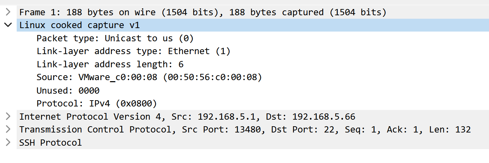

# pcapture-rs

A new generation of traffic capture library based on `libpnet`.

This library requires root permissions.

## Advantages compared to other libraries

### [pcap](https://crates.io/crates/pcap)

It is undeniable that `libpcap` is indeed a very powerful library, but its rust encapsulation `pcap` seems a bit unsatisfactory.

The first is that when using `pcap` to capture traffic, I cannot get any data on the data link layer (it uses a fake data link layer data). I tried to increase the executable file's permissions to root, but I still got a fake data link layer header, as shown in the figure below (this is actually an important reason for launching this project).



Secondly, this `pcap` library does not support filters, which is easy to understand. In order to implement packet filtering, we have to implement these functions ourselves (it will be very uncomfortable to use).

The third is that you need to install additional libraries (`libpcap` & `libpcap-dev`) to use the `pcap` library.

### [pcap-parser](https://crates.io/crates/pcap-parser)

The disadvantage of this library is very obvious, because it only supports processing `pcap` and `pcapng` files, and does not support capturing traffic.

### [pcap-file-gsg](https://crates.io/crates/pcap-file-gsg)

Same as above.

## Usage

The `pcapng` format only (default)
```toml
pcapture = { version = "^0", features = ["pcapng"] }
```

The `pcap` format only
```toml
pcapture = { version = "^0", features = ["pcap"] }
```

## Examples

### Very simple way to capture the packets as pcapng format

```rust
use pcapture::PcapByteOrder;
use pcapture::Capture;
use pcapture::pcapng::PcapNg; // for read pcapng file

fn main() {
    let path = "test.pcapng";
    let pbo = PcapByteOrder::WiresharkDefault;
    /// You must specify the port, the 'all' option is not supported.
    let mut cap = Capture::new("ens33").unwrap();
    let mut pcapng = cap.gen_pcapng(pbo);
    for _ in 0..5 {
        let block = cap.next_with_pcapng().unwrap();
        pcapng.append(block);
    }
    /// write all capture data to test.pcapng
    pcapng.write_all(path).unwrap();

    let read_pcapng = PcapNg::read_all(path, pbo).unwrap();
    /// By default, epb (EnhancedPacketBlock) is used to store data instead of spb (SimplePacketBlock).
    /// 1 shb + 1 idb + 5 epb = 7
    assert_eq!(read_pcapng.blocks.len(), 7);
}
```

### And also the pcap format

Since pcap uses a 16-bit timestamp, it will be exhausted in 2038 (although it sounds far away), so it is recommended to use pcapng now.

```rust
use pcapture::PcapByteOrder;
use pcapture::Capture;
use pcapture::pcap::Pcap; // for read pcap file

fn main() {
    let path = "test.pcap";
    let pbo = PcapByteOrder::WiresharkDefault;

    let mut cap = Capture::new("ens33").unwrap();
    let mut pcap = cap.gen_pcap(pbo);
    for _ in 0..5 {
        let record = cap.next_with_pcap().unwrap();
        pcap.append(record);
    }
    /// write all capture data to test.pcap
    pcap.write_all(path).unwrap();

    let read_pcap = Pcap::read_all(path, pbo).unwrap();
    /// The pcap file format and the pcapng file have completely different structures.
    /// And pcap has only one file header,
    /// but pcapng can have various headers with different functions.
    /// 5 records, you can access the file header through 'read_pcap.header'.
    assert_eq!(read_pcap.records.len(), 5);
}
```

### Same the pcapture support capture packet as row format

```rust
use pcapture::Capture;

fn main() {
    let mut packets: Vec<Vec<u8>> = Vec::new();
    let mut cap = Capture::new("ens33").unwrap();
    for _ in 0..5 {
        let packet_raw = cap.next_with_raw().unwrap();
        packets.push(packet_raw)
    }
}
```

### And the most important filter features

I implemented a simple expression filter using the Shunting Yard algorithm.

```rust
use pcapture::PcapByteOrder;
use pcapture::Capture;

fn main() {
    let path = "test.pcapng";
    let pbo = PcapByteOrder::WiresharkDefault;
    /// Building filters is very simple and easy to understand.
    /// And support protocol filtering.
    let filter_str = "tcp and (ip=192.168.1.1 and port=80)";
    /// Only support this bracket '(' in expression, but 'AND' and 'OR' support both uppercase and lowercase.
    /// More examples:
    // let filter_str = "tcp and (ip=192.168.1.1 or port=80)";
    // let filter_str = "icmp and ip=192.168.1.1";
    // let filter_str = "!icmp and ip=192.168.1.1"; // ! means not include any icmp packet
    // let filter_str = "icmp and ip!=192.168.1.1"; // != means not include any packet which addr is 192.168.1.1
    /// Other valid values:
    /// [mac, srcmac, dstmac, ip, addr, srcip, srcaddr, dstip, dstaddr, port, srcport, dstport]
    /// Note: the expression ip=192.168.1.1 is equal to addr=192.168.1.1

    /// You can use the following code to print all supported protocols.
    // use pcapture::filter;
    // let valid_procotol = filter::valid_protocol();
    // println!("{:?}", valid_procotol);

    let mut cap = Capture::new_with_filters("ens33", filter_str).unwrap();
    let mut pcapng = cap.gen_pcapng(pbo);
    for _ in 0..5 {
        let block = cap.next_with_pcapng().unwrap();
        pcapng.append(block);
    }
    pcapng.write_all(path).unwrap();
}
```

### Sometimes you just wanna write the packet to the disk immediately

The above examples all store the captured packets in memory and then write them to disk at once use `write_all` function, but this is not acceptable in practice, because this will cause a lot of memory usage on the server.

```rust
use std::fs::File;
use pcapture::PcapByteOrder;
use pcapture::Capture;

fn main() {
    let path = "test.pcapng";
    let pbo = PcapByteOrder::WiresharkDefault;
    let fs = File::create(path).unwrap();

    let mut cap = Capture::new("ens33").unwrap();
    let mut pcapng = cap.gen_pcapng(pbo);
    /// Write the pcapng headers to disk.
    pcapng.write(fs).unwrap();

    for _ in 0..5 {
        let block = cap.next_with_pcapng().unwrap();
        /// Accept one and write one.
        block.write(fs, pbo).unwrap();
    }
}
```